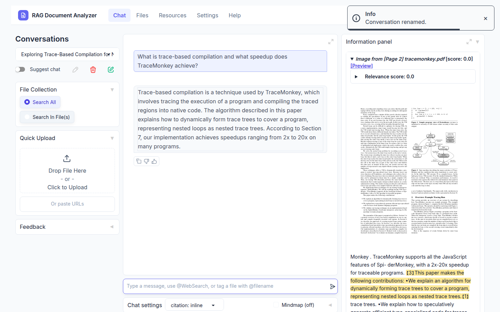
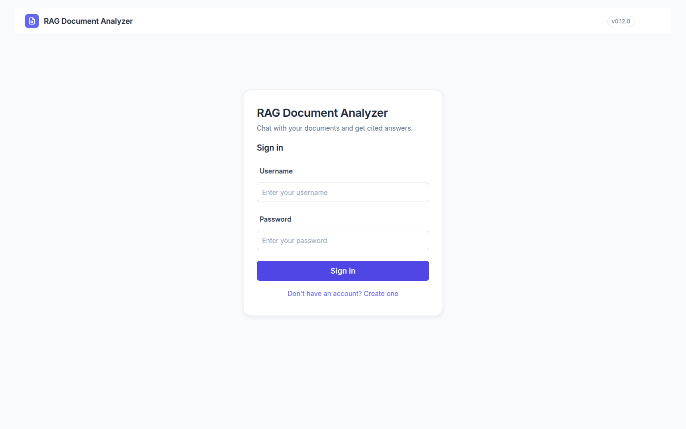

# RAG Document Analyzer

Chat with your documents and get answers you can check. Upload PDFs, Office
files, spreadsheets or web pages, ask questions in plain language, and every
answer comes with citations that open the exact passage in the source.



## Features

- **Cited answers**: each answer links to the passages it used; open them in
  the built-in PDF viewer with the relevant text highlighted.
- **Hybrid search**: full-text and vector search combined, with optional
  re-ranking, so the right passages are found.
- **Many file types**: PDF, Word, Excel, PowerPoint, CSV, HTML, Markdown,
  text, images and zip archives, or paste web URLs.
- **Accounts**: users can create their own account; each user's files and
  conversations are private. The admin manages users and models.
- **Any model**: OpenAI, Azure OpenAI, Gemini, Claude, Groq, Mistral, Cohere,
  or fully local models through [Ollama](https://ollama.com), with no API key
  needed.
- **Advanced reasoning**: question decomposition and agent-based (ReAct,
  ReWOO) answering for complex, multi-step questions.
- **Light and dark mode**, and a layout that works on phones.



## Quick start

Requirements: Python 3.10+, and [uv](https://docs.astral.sh/uv/) (recommended)
or pip.

```shell
git clone https://github.com/Arslanabbas102/RAG-Document-Analyzer-.git
cd RAG-Document-Analyzer-

# install
uv sync --python 3.10
source .venv/bin/activate

# configure (see "Choosing a model" below)
cp .env.example .env

# run
python app.py
```

Open <http://localhost:7860> and sign in with the default admin account
**`admin` / `admin`**. **Change this password right away** in
*Settings → User settings*. Other people can use *Create account* on the
sign-in page.

### In-browser PDF viewer (recommended)

To open citations inside PDFs, download
[PDF.js 4.0.379](https://github.com/mozilla/pdf.js/releases/download/v4.0.379/pdfjs-4.0.379-dist.zip)
and extract it to `libs/ktem/ktem/assets/prebuilt/pdfjs-4.0.379-dist/`, or run
this (from a folder path without spaces):

```shell
bash scripts/download_pdfjs.sh libs/ktem/ktem/assets/prebuilt/pdfjs-4.0.379-dist
```

### With Docker

```shell
docker build -t rag-document-analyzer --target lite .
docker run -p 7860:7860 \
  -e GRADIO_SERVER_NAME=0.0.0.0 -e GRADIO_SERVER_PORT=7860 \
  -v ./ktem_app_data:/app/ktem_app_data \
  rag-document-analyzer
```

Use `--target full` for extra file types (`.doc`, `.docx`, ... via
Unstructured).

## Choosing a model

Models are read from `.env` on the **first run** and then stored in the app's
database. After that, the admin manages them in
*Resources → LLMs / Embeddings*.

**Cloud API (fastest).** Set one key in `.env`, for example:

```shell
OPENAI_API_KEY=sk-...        # OpenAI
# or
GOOGLE_API_KEY=...           # Gemini
```

**Local models (free, private, no key).** With no cloud key set, the app uses
Ollama for answers and FastEmbed for search:

```shell
ollama pull llama3.2:3b
OLLAMA_CONTEXT_LENGTH=8192 ollama serve
```

and in `.env`:

```shell
LOCAL_MODEL=llama3.2:3b
```

`OLLAMA_CONTEXT_LENGTH` matters: Ollama's default context is small and would
silently cut off the retrieved text. On a CPU-only machine, local answers take
minutes; these settings keep them as short as possible:

```shell
USE_LOW_LLM_REQUESTS=true    # skip extra LLM calls (scoring, mind map, citation pass)
KH_MAX_CONTEXT_LENGTH=3000   # cap the retrieved text sent with each question
```

## Configuration

| Setting (`.env`) | Default | Purpose |
|---|---|---|
| `KH_APP_NAME` | `RAG Document Analyzer` | Name shown in the header and sign-in page |
| `KH_FEATURE_USER_SIGNUP` | `true` | Show *Create account* on the sign-in page |
| `KH_FEATURE_USER_MANAGEMENT` | `true` | Require sign-in (accounts) |
| `KH_GITHUB_REPO` | `Arslanabbas102/RAG-Document-Analyzer-` | Repo linked from the Help page |
| `LOCAL_MODEL` | | Ollama model used when no cloud key is set |
| `USE_LOW_LLM_REQUESTS` | `false` | Fewer LLM calls per question (for slow hardware) |
| `KH_MAX_CONTEXT_LENGTH` | `32000` | Max tokens of retrieved text per question |
| `USE_LIGHTRAG` / `USE_MS_GRAPHRAG` | on if installed | Graph-based collections ([setup](https://github.com/Cinnamon/kotaemon#setup-graphrag)) |

Storage backends, reasoning pipelines and other advanced options live in
[`flowsettings.py`](flowsettings.py). All app data (database, uploaded files,
indexes) is kept in `ktem_app_data/`; back up that folder to move an install.

### Document parsing for scanned files

For OCR, tables and figures, select a loader in *Settings → Retrieval
settings → File loader*: Azure Document Intelligence, Adobe PDF Extract,
[Docling](docs/integrations/docling.md) or
[PaddleOCR](docs/integrations/paddle_ocr.md).

## Before going public

- Change the default `admin` password.
- Set `KH_FEATURE_USER_SIGNUP=false` if you don't want open registration.
- Serve it over HTTPS (for example behind a reverse proxy) so passwords
  aren't sent in plain text.

## Credits and license

RAG Document Analyzer is built on [kotaemon](https://github.com/Cinnamon/kotaemon)
by Cinnamon AI, licensed under the [Apache License 2.0](LICENSE.txt). The
internal Python packages keep their original names (`kotaemon`, `ktem`).
